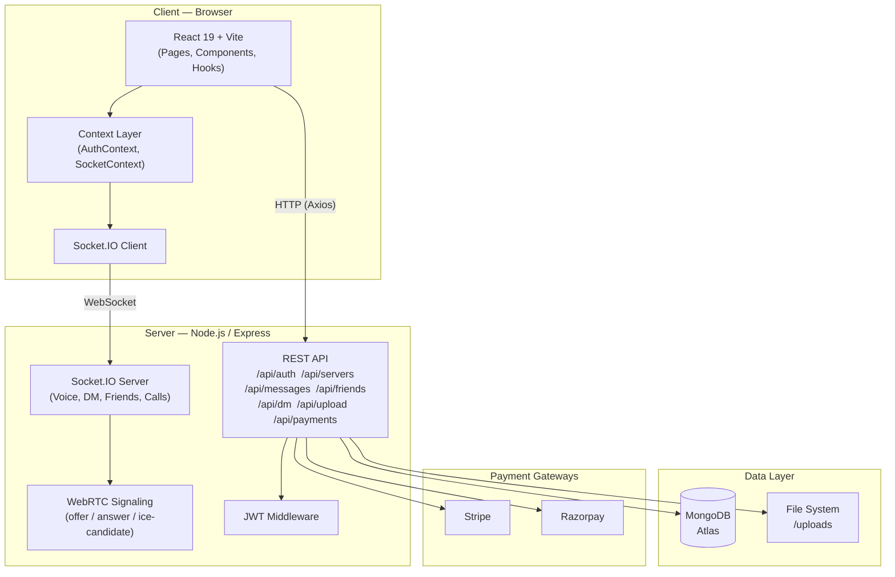

<h1 align="center">Cyber-Chat</h1>

<h4 align="center">A full-stack, real-time chat platform inspired by Discord — with servers, channels, DMs, voice/video calls, and premium subscriptions.</h4>

<p align="center">
  
  
  
  
  
</p>

---

## Table of Contents

- [Features](#features)
- [Architecture](#architecture)
- [Project Structure](#project-structure)
- [Tech Stack](#tech-stack)
- [Prerequisites](#prerequisites)
- [Getting Started](#getting-started)
- [Environment Variables](#environment-variables)
- [API Reference](#api-reference)
- [Socket.IO Events](#socketio-events)
- [Payment Integration](#payment-integration)
- [Contributing](#contributing)

---

## Features

| Feature | Description |
|---|---|
| **Authentication** | Secure signup/login with JWT and bcrypt password hashing |
| **Servers and Channels** | Create servers, manage text channels, invite members |
| **Real-Time Messaging** | Instant messages with reactions, file uploads, edit and delete |
| **Friends System** | Send, accept, and decline friend requests in real-time |
| **Direct Messages** | Private 1-on-1 conversations with read receipts |
| **Voice Channels** | WebRTC-powered multi-user voice with mute/unmute controls |
| **Video Calls** | WebRTC-powered video calling with toggle controls |
| **Live Notifications** | Server-wide real-time join/leave/message notifications |
| **Nitro Premium** | Subscription plans powered by Stripe and Razorpay |
| **File Uploads** | Avatar and media uploads via Multer |

---

## Architecture



---

## Project Structure

```
chat-application/
└── chat-app/
    ├── src/                        # React frontend (Vite)
    │   ├── components/
    │   │   ├── dashboard/          # Main chat dashboard components
    │   │   ├── home/               # Home-screen components
    │   │   ├── landing/            # Landing page components
    │   │   ├── layout/             # Layout wrappers and sidebar
    │   │   ├── modals/             # Modal dialogs (create server, invite, etc.)
    │   │   └── ui/                 # Reusable UI primitives
    │   ├── context/                # React Context (auth, socket)
    │   ├── hooks/                  # Custom React hooks
    │   ├── lib/                    # Utility libraries (axios instance, etc.)
    │   ├── pages/                  # Page-level components
    │   │   ├── Dashboard.jsx
    │   │   ├── Login.jsx
    │   │   ├── Signup.jsx
    │   │   ├── NitroCheckout.jsx
    │   │   └── LandingPage.jsx
    │   └── utils/                  # Helper functions
    │
    ├── server/                     # Node.js / Express backend
    │   ├── middleware/             # Auth middleware (JWT verification)
    │   ├── models/                 # Mongoose schemas
    │   │   ├── User.js
    │   │   ├── Server.js
    │   │   ├── Channel.js
    │   │   ├── Message.js
    │   │   ├── DirectMessage.js
    │   │   ├── Conversation.js
    │   │   ├── FriendRequest.js
    │   │   ├── Payment.js
    │   │   └── VoiceSession.js
    │   ├── routes/                 # Express REST routes
    │   │   ├── auth.js
    │   │   ├── servers.js
    │   │   ├── channels.js
    │   │   ├── messages.js
    │   │   ├── friends.js
    │   │   ├── dm.js
    │   │   ├── upload.js
    │   │   ├── payments.js
    │   │   └── webhook.js
    │   └── index.js                # Express entry point and Socket.IO setup
    │
    ├── public/                     # Static assets
    ├── uploads/                    # Uploaded files (served statically)
    ├── index.html
    ├── vite.config.js
    └── tailwind.config.js
```

---

## Tech Stack

### Frontend

| Technology | Version | Purpose |
|---|---|---|
| React | 19 | UI framework |
| Vite | 7 | Build tool and dev server |
| Tailwind CSS | 4 | Utility-first styling |
| Framer Motion | 12 | Animations and transitions |
| Socket.IO Client | 4 | Real-time WebSocket communication |
| React Router DOM | 7 | Client-side routing |
| Axios | 1 | HTTP requests |
| Lucide React | — | Icon library |
| React Hot Toast | 2 | Toast notifications |

### Backend

| Technology | Version | Purpose |
|---|---|---|
| Node.js | — | Runtime environment |
| Express | 4 | REST API framework |
| Socket.IO | 4 | WebSocket server |
| Mongoose | 8 | MongoDB ODM |
| JWT | 9 | Authentication tokens |
| bcryptjs | 2 | Password hashing |
| Multer | 2 | File upload handling |
| Stripe | 20 | Western payment gateway |
| Razorpay | 2 | Indian payment gateway |
| dotenv | 16 | Environment variables |

---

## Prerequisites

Before you begin, ensure you have the following installed:

- **Node.js** v18+ — [Download](https://nodejs.org/)
- **npm** v9+
- **MongoDB** — [MongoDB Atlas](https://www.mongodb.com/cloud/atlas) (cloud) or local instance
- **Stripe Account** — [stripe.com](https://stripe.com) (for payment features)
- **Razorpay Account** — [razorpay.com](https://razorpay.com) (for payment features)

---

## Getting Started

### 1. Clone the Repository

```bash
git clone https://github.com/your-username/cyber-chat.git
cd cyber-chat/chat-app
```

### 2. Install Frontend Dependencies

```bash
npm install
```

### 3. Install Backend Dependencies

```bash
cd server
npm install
cd ..
```

### 4. Configure Environment Variables

See the [Environment Variables](#environment-variables) section below and create `server/.env`.

### 5. Run the Application

Open **two terminals**:

**Terminal 1 — Backend Server:**
```bash
cd server
npm run dev
# Server starts at http://localhost:5000
```

**Terminal 2 — Frontend Dev Server:**
```bash
# From the chat-app root
npm run dev
# App starts at http://localhost:5173
```

Open your browser and navigate to **http://localhost:5173**.

---

## Environment Variables

Create a file at `chat-app/server/.env` with the following keys:

```env
# Database
MONGO_URI=your_mongodb_connection_string

# Authentication
JWT_SECRET=your_jwt_secret

# Application
PORT=5000
CLIENT_URL=http://localhost:5173

```

> **Warning:** Never commit your `.env` file to version control. It is already included in `.gitignore`.

---

## API Reference

All endpoints are prefixed with `/api`.

### Auth — `/api/auth`

| Method | Endpoint | Description | Auth Required |
|--------|----------|-------------|---------------|
| POST | `/register` | Register a new user | No |
| POST | `/login` | Login and receive JWT | No |
| GET | `/me` | Get current user profile | Yes |
| PUT | `/profile` | Update profile / avatar | Yes |

### Servers — `/api/servers`

| Method | Endpoint | Description | Auth Required |
|--------|----------|-------------|---------------|
| GET | `/` | Get all servers for user | Yes |
| POST | `/` | Create a new server | Yes |
| GET | `/:id` | Get a specific server | Yes |
| PUT | `/:id` | Update server details | Yes |
| DELETE | `/:id` | Delete a server | Yes |
| POST | `/:id/join` | Join a server via invite | Yes |
| POST | `/:id/leave` | Leave a server | Yes |

### Channels — `/api/channels`

| Method | Endpoint | Description | Auth Required |
|--------|----------|-------------|---------------|
| GET | `/:serverId` | Get channels for a server | Yes |
| POST | `/:serverId` | Create a new channel | Yes |
| DELETE | `/:id` | Delete a channel | Yes |

### Messages — `/api/messages`

| Method | Endpoint | Description | Auth Required |
|--------|----------|-------------|---------------|
| GET | `/:channelId` | Get messages for a channel | Yes |
| POST | `/:channelId` | Send a message | Yes |
| PUT | `/:messageId` | Edit a message | Yes |
| DELETE | `/:messageId` | Delete a message | Yes |

### Friends — `/api/friends`

| Method | Endpoint | Description | Auth Required |
|--------|----------|-------------|---------------|
| GET | `/` | Get friend list | Yes |
| POST | `/request` | Send friend request | Yes |
| PUT | `/accept/:id` | Accept friend request | Yes |
| DELETE | `/decline/:id` | Decline or remove friend | Yes |

### Direct Messages — `/api/dm`

| Method | Endpoint | Description | Auth Required |
|--------|----------|-------------|---------------|
| GET | `/conversations` | List all DM conversations | Yes |
| GET | `/:conversationId` | Get messages in a conversation | Yes |
| POST | `/:conversationId` | Send a direct message | Yes |

### Payments — `/api/payments`

| Method | Endpoint | Description | Auth Required |
|--------|----------|-------------|---------------|
| POST | `/stripe/create-session` | Create Stripe checkout session | Yes |
| POST | `/razorpay/create-order` | Create Razorpay order | Yes |
| POST | `/razorpay/verify` | Verify Razorpay payment | Yes |

---

## Socket.IO Events

Cyber-Chat uses Socket.IO for all real-time features.

### Voice Channel Events

| Event (Client Emits) | Event (Client Listens) | Description |
|---|---|---|
| `join-voice` | `voice-users` | Join a voice channel, receive current peers list |
| `leave-voice` | `user-left-voice` | Leave a voice channel |
| `toggle-mute` | `user-toggled-mute` | Toggle microphone mute state |
| `toggle-video` | `user-toggled-video` | Toggle camera on/off |
| `speaking` | `user-speaking` | Speaking activity indicator |
| `offer` / `answer` / `ice-candidate` | same | WebRTC signaling for P2P connections |

### Messaging Events

| Event (Client Emits) | Event (Client Listens) | Description |
|---|---|---|
| `join-server-room` | — | Subscribe to server-wide notifications |
| `new-message` | `server-notification` | Broadcast message notification in server |
| `send-direct-message` | `direct-message-received` | Real-time DM delivery |
| `delete-direct-message` | `direct-message-deleted` | Real-time DM deletion |
| `react-direct-message` | `direct-message-reacted` | Real-time emoji reactions |

### Friends and Calls Events

| Event (Client Emits) | Event (Client Listens) | Description |
|---|---|---|
| `join-user-room` | — | Subscribe to personal notifications |
| `send-friend-request` | `friend-request-received` | Friend request notification |
| `accept-friend-request` | `friend-request-accepted` | Acceptance notification |
| `call-invite` | `incoming-call` | Initiate audio/video call |
| `call-accepted` | `call-was-accepted` | Call accepted signal |
| `call-declined` | `call-was-declined` | Call declined signal |

---

## Payment Integration

Cyber-Chat supports Nitro-style premium subscriptions through two payment gateways:

- **Stripe** — For global/international payments. Uses Stripe Checkout sessions with webhook verification via `/api/webhook`.
- **Razorpay** — For Indian payment methods (UPI, Net Banking, Cards). Uses order creation and client-side verification flow.

Both gateways are fully handled server-side for security.

---

## Contributing

Contributions are welcome. To get started:

1. **Fork** the repository.
2. **Create** a new feature branch: `git checkout -b feature/your-feature-name`
3. **Commit** your changes: `git commit -m 'feat: add some feature'`
4. **Push** to your branch: `git push origin feature/your-feature-name`
5. **Open** a Pull Request.

Please follow [Conventional Commits](https://www.conventionalcommits.org/) for commit messages.

---

## License

This project is licensed under the **MIT License**. See the [LICENSE](LICENSE) file for details.

---

<p align="center">Made with care by <strong>Rupasree</strong> &middot; 2026</p>
